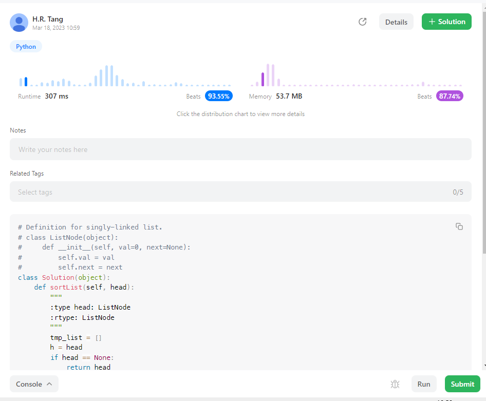
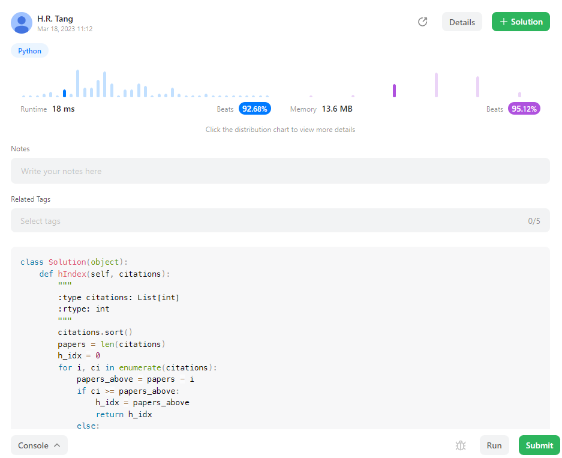

## AIgo_Homework_03

唐浩然 

2201111746


#### LeetCode 56


**code：**

```python
class Solution(object):
    def merge(self, intervals):
        """
        :type intervals: List[List[int]]
        :rtype: List[List[int]]
        """
        re = []
        intervals.sort(key=lambda x:x[0])
        right_re = intervals[0][1]
        left_re = intervals[0][0]
        for inter in intervals[1:]:
            left = inter[0]
            right = inter[1]
            if left <= right_re:
                right_re = max(right_re, right)
            else:
                re.append([left_re, right_re])
                left_re = left
                right_re = right
        re.append([left_re, right_re])
        return re
```

**算法思路：**

首先对所有列表中所有区间按左端点大小进行升序排序，接下来对于区间进行遍历，只需要维护此时合并区间的右端点即可，判断当前区间左端点是否小于等于合并区间右端点，

1. 如果小于等于则区间合并，并重新判断此时最远右端点；
2. 如果大于则产生新的区间，将旧的合并区间写入输出列表中，重新对区间左右端点赋值；

#### LeetCode 148



**code:**

```python
# Definition for singly-linked list.
# class ListNode(object):
#     def __init__(self, val=0, next=None):
#         self.val = val
#         self.next = next
class Solution(object):
    def sortList(self, head):
        """
        :type head: ListNode
        :rtype: ListNode
        """
        tmp_list = []
        h = head
        if head == None:
            return head
        while h.next != None:
            tmp_list.append(h.val)
            h = h.next
        tmp_list.append(h.val)
        tmp_list.sort()
        h = head
        idx = 0
        while h.next != None:
            h.val = tmp_list[idx]
            idx += 1
            h = h.next
        h.val = tmp_list[idx]
        return head
```

**算法思路：**

这道题看似是个链表排序，而python中貌似没有直接针对链表的排序方法，写一个又很麻烦；因此先把链表读到List里面再List.sort（）排序后写回链表，即可得到排序后的链表hhhhhhhhhhhhXD

#### LeetCode 274



**code:**

```python
class Solution(object):
    def hIndex(self, citations):
        """
        :type citations: List[int]
        :rtype: int
        """
        citations.sort()
        papers = len(citations)
        h_idx = 0
        for i, ci in enumerate(citations):
            papers_above = papers - i
            if ci >= papers_above:
                h_idx = papers_above
                return h_idx
            else:
                continue
        return h_idx
            
```

**算法思路：**

按照h-index的定义，首先对于citations列表进行升序排序，之后对于h-index只需按照论文数量从高到低进行搜索即可，具体为对排序后的citations进行遍历，每遍历到一个位置都可以知道此时大于等于该引用数量的论文有多少，此时判断当前引用数是否大于等于当前论文数量，如果是则直接返回最大h-index，如果小于则继续搜索；该方法可以保证得到h-index结果时后续不会有更大的结果；


