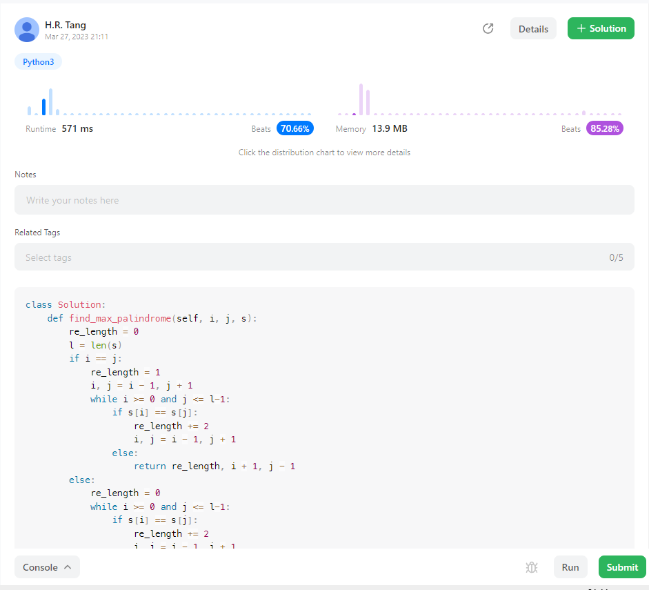
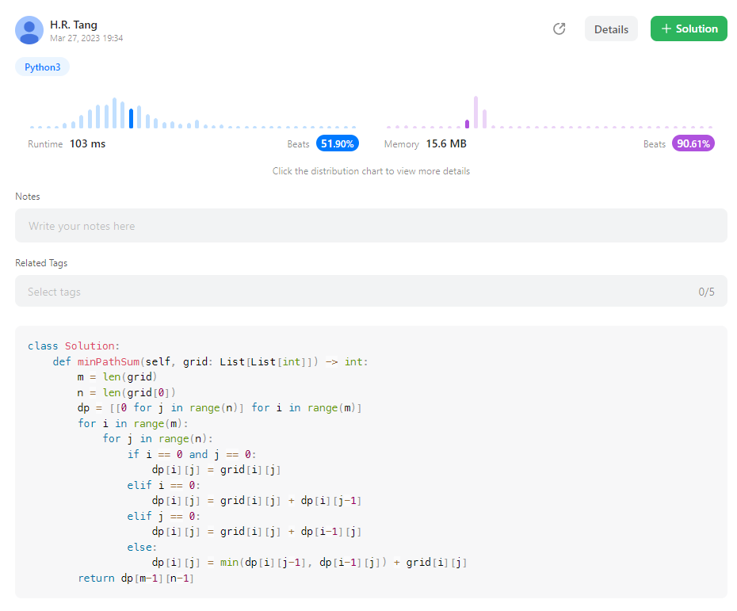
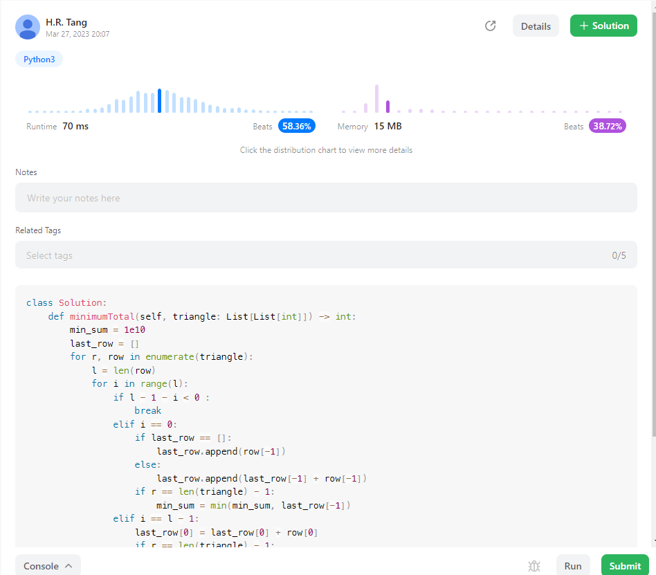

## Algo_Homework_05

唐浩然 

2201111746


#### LeetCode 5



**code：**

```python
class Solution:
    def find_max_palindrome(self, i, j, s):
        re_length = 0
        l = len(s)
        if i == j:
            re_length = 1
            i, j = i - 1, j + 1 
            while i >= 0 and j <= l-1:
                if s[i] == s[j]:
                    re_length += 2
                    i, j = i - 1, j + 1 
                else:
                    return re_length, i + 1, j - 1
        else:
            re_length = 0
            while i >= 0 and j <= l-1:
                if s[i] == s[j]:
                    re_length += 2
                    i, j = i - 1, j + 1 
                else:
                    return re_length, i + 1, j - 1
        return re_length, i + 1, j - 1
    def longestPalindrome(self, s: str) -> str:
        i = 0
        j = 0
        l = len(s)
        re_i = 0
        re_j = 0
        max_palin = 0
        while i < l and j < l:
            re, tmp_i, tmp_j = self.find_max_palindrome(i, j, s)
            if re > max_palin:
                max_palin = re
                re_i = tmp_i
                re_j = tmp_j
            j += 1
            re, tmp_i, tmp_j = self.find_max_palindrome(i, j, s)
            if re > max_palin:
                max_palin = re
                re_i = tmp_i
                re_j = tmp_j
            i += 1
        return s[re_i:re_j+1]
```

**算法思路：**

枚举所有中心点，在中心点两侧利用两个指针向两侧遍历判断其是否对称，对称则继续遍历；需要注意的是，中心点包含字符串中的元素（奇数Palindrome）和空（偶数Palindrome）;时间复杂度为O(n2)

#### LeetCode 64



**code:**

```python
class Solution:
    def minPathSum(self, grid: List[List[int]]) -> int:
        m = len(grid)
        n = len(grid[0])
        dp = [[0 for j in range(n)] for i in range(m)]
        for i in range(m):
            for j in range(n):
                if i == 0 and j == 0:
                    dp[i][j] = grid[i][j]
                elif i == 0:
                    dp[i][j] = grid[i][j] + dp[i][j-1]
                elif j == 0:
                    dp[i][j] = grid[i][j] + dp[i-1][j]
                else:
                    dp[i][j] = min(dp[i][j-1], dp[i-1][j]) + grid[i][j]
        return dp[m-1][n-1]
```

**算法思路：**

这道题采用动态规划的方法，$dp[i][j]$ 中存储从起点 (0,0) 到该点的最小距离；而$dp[i][j]$满足如下转移方程；其中grid数组为题目输入；
$$
dp[i][j] = \begin{equation}
\left\{
\begin{array}{lr}
dp[0][0], & i = 0 & j = 0\\
dp[i][j-1] + grid[i][j] , & i = 0 & j \neq 0 \\
dp[i-1][j] + grid[i][j] , & i\neq 0 &j = 0\\
min(dp[i][j-1], dp[i-1][j]) + grid[i][j], & i\neq 0 &j \neq 0
\end{array}
\right.
\end{equation}
$$


#### LeetCode 120


**code:**

```python
class Solution:
    def minimumTotal(self, triangle: List[List[int]]) -> int:
        min_sum = 1e10
        last_row = []
        for r, row in enumerate(triangle):
            l = len(row)
            for i in range(l):
                if l - 1 - i < 0 :
                    break
                elif i == 0:
                    if last_row == []:
                        last_row.append(row[-1])
                    else:
                        last_row.append(last_row[-1] + row[-1])
                    if r == len(triangle) - 1:
                        min_sum = min(min_sum, last_row[-1])
                elif i == l - 1:
                    last_row[0] = last_row[0] + row[0]
                    if r == len(triangle) - 1:
                        min_sum = min(min_sum, last_row[0])
                else:
                    last_row[l-1-i] = min(last_row[l-1-i], last_row[l-2-i]) + row[l-1-i]
                    if r == len(triangle) - 1:
                        min_sum = min(min_sum, last_row[l-1-i])
        return min_sum
            
```

**算法思路：**

这道题目的思路也是动态规划，为了节省空间，只需额外提供一个长度为triangle.length的额外数组开销；

可知下一层的某一点的最小值，仅由上一层 i, i-1中的最小值加上当前值得到，因此只需从上到下计算每一层的最小值即可，动态规划的转移方程为：（假设当前层的长度为len）
$$
dp[i][j] = \begin{equation}\left\{\begin{array}{lr}dp[i-1][j] + triangle[i][j], & j = 0\\
dp[i-1][j-1] + triangle[i][j] , &  j = len \\
min(dp[i-1][j],dp[i-1][j-1]) + triangle[i][j] , & else\\
\end{array}\right.\end{equation}
$$
