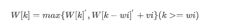
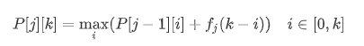

## AIgo_Homework_06

唐浩然 

2201111746


#### 1. 背包问题（Knapsack Problem）

一个旅行者随身携带一个背包, 可以放入背包的物品有n种, 每种物品的重量和价值分别是wi , vi , i=1,…, n. 如果背包的最大容量限制是b, 怎样选择放入背包的物品以使得背包的价值最大?


解：背包问题本质上也是动态规划问题，首先维护一个一维数组 W[k] ($k\in[0,b]$), 其中 W[k] 表示**当前已经遍历过的物品（1,...,i）条件下**背包容量为k条件下的最大价值；

因此该问题只需在遍历过所有的n个物品后取出W[b], 此时W[b] 即为所求解；

该问题的状态转移方程可以表示为：



其中$W[k]^{'}$表示表示此时利用的是上一轮结果，因此在实际更新时需要维护额外的临时数组；

解法代码如下：

```python
class Solution:
    def Knapsack(self, Things: List[tuple(double,double)], max_cap: double) -> double:
        W = [0 for i in range(max_cap+1)]
        for t in Things:
            wi, vi = t[0], t[1]
            tmp = W.copy()
            if wi <= max_cap:
                for i in range(wi, max_cap+1):
                    W[i] = max(tmp[i], tmp[i-wi]+vi)
        return W[max_cap]
```

该问题的复杂度为O(n*b)

#### 2.投资问题

设有m元钱，n项投资，函数 f i (x) 表示将x元钱投入到第 i 项项目所产生的效益，i=1,…, n. 问：如何分配这m元钱，使得投资的总效益最高？


解：该问题亦可以使用动态规划求解，其中状态P[ j ] [k] 表示在投资前j个项目的情况下，投资金额为k元时的最大收益；

则此时该问题的状态转移方程为：



初始状态全为0初始化，最后该问题的输出为P[n] [m];

解法代码如下：

```python
class Solution:
    def Knapsack(self, Project: List[List[double]], money: int) -> double:
        m = money
        n = len(Project)
        P = [[0]*range(m+1)]*range(n+1)
        for j in range(1,n+1):
            for k in range(1,m+1):
                for l in range(0,k+1):
                    P[j][k] = max(P[j][k], P[j-1][l] + Project[j-1][k-l])
        return P[n][m]
```

