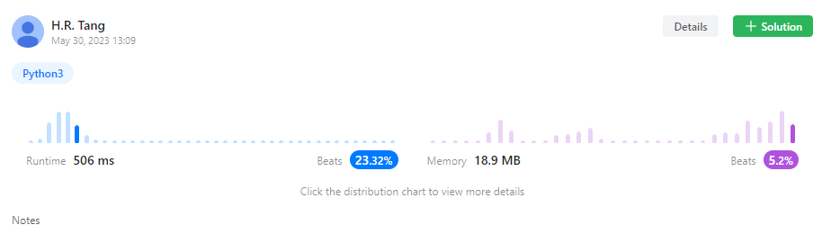
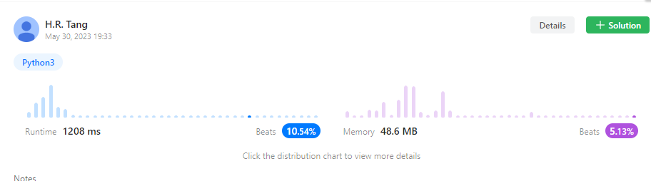

## AIgo_Homework_11

唐浩然 

2201111746


#### LeetCode 743



**code：**

```python
import queue
class Solution:
    def networkDelayTime(self, times, n: int, k: int) -> int:
        inf = 0x7fffffff
        edges = [[] for i in range(n+1)]
        q = queue.PriorityQueue()
        for ei in times:
            s = ei[0]
            edges[s].append(ei)
        nodes = []
        flag = [True for i in range(n+1)]
        dist = [inf for i in range(n+1)]
        dist[k] = 0
        nodes.append(k)
        flag[0] = False
        flag[k] = False
        for ei in edges[k]:
            dist[ei[1]] = min(dist[ei[1]], dist[ei[0]]+ei[2])
        while(sum(flag) != 0):
            for i, dis in enumerate(dist):
                if flag[i] == True:
                    q.put([dis, i])
            min_dist = q.get()
            if min_dist[0] == inf:
                return -1
            else:
                q = queue.PriorityQueue()
                flag[min_dist[1]] = False
                for ei in edges[min_dist[1]]:
                    dist[ei[1]] = min(dist[ei[1]], dist[ei[0]]+ei[2])
        min_time = max(dist[1:])
        if min_time == inf:
            return -1
        else:
            return min_time
```

**算法思路：**

由于题目中没有负权边，利用Dijsktra算法即可求出单源最短路；

#### Leetcode 847



**code:**

```python
class Solution:
    def shortestPathLength(self, graph: List[List[int]]) -> int:
        queue = []
        step = 0
        n = len(graph)
        if n == 1:
            return 0
        for i in range(n):
            queue.append([1<<i, i])
        while 1:
            new_queue = []
            step += 1
            for qi in queue:
                value = qi[0]
                node = qi[1]
                for ei in graph[node]:
                    vi = value | 1<<ei
                    if vi == ((1<<n) - 1):
                        return step
                    new_queue.append((vi, ei))
            queue = list(set(new_queue))
        return
```

**算法思路：**

这道题由于题目中给定的图为连通图，因此考虑使用队列结构进行BFS广搜，该题目的难点在于如何对于已搜索状态进行存储表示，直接存储为数组可能会MLE，由于题目中n <= 12，因此可以利用bit manipulation进行表示，即每个bit表示对应的节点是否访问，访问为1，否则为0；只需利用左移<<以及或运算|即可完成状态存储；考虑到在BFS过程中会存储很多重复状态（即当前节点相同且访问过节点相同），因此利用set去除重复项以避免MLE；

